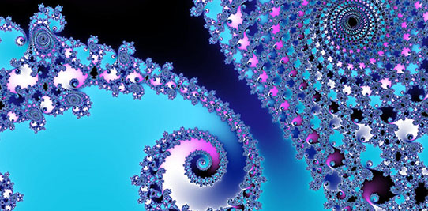

# Procedural Rendering: Digest 1
## By Alex Cusseaux

Procedural rendering (PR for short) is when an algorithm is used to create data instead of it having to be in put manually by the creator.

It is used to create graphics such as textures and three dimensional models, as well as in video game to reduce the amount of files needed for a specific component, therefor leaving more space to add more things to the game as well as increase the speed. PR can also be used to make games seem more random than pre programmed which is nicer for players.

Things that can be procedurally generated:

1. Fractals

2. Textures

3. Meshes

4. Speech synthesis

5. Music

### 1. Fractals

> **A description of fractals:**
The feature of "self-similarity", for instance, is easily understood by analogy to zooming in with a lens or other device that zooms in on digital images to uncover finer, previously invisible, new structure. If this is done on fractals, however, no new detail appears; nothing changes and the same pattern repeats over and over, or for some fractals, nearly the same pattern reappears over and over.

### 2. Textures and texture mapping

Texture mapping is how high frequency detail, surface texture, or color  can be applied to a on a graphic or 3D form.

----
### **Sources**

[Procedural rendering](https://en.wikipedia.org/wiki/Procedural_generation)

[Fractals](https://en.wikipedia.org/wiki/Fractal)

[Texture mapping](https://en.wikipedia.org/wiki/Texture_mapping)
