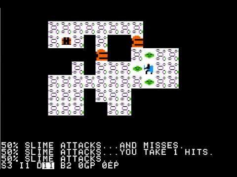

# Guiding Questions

- Briefly explain the main idea behind the technology you're researching, what is it exactly? what is it for? How does it work?

- Who are the important people and/or organizations related to this technology? Don't just list names, briefly explain who these are and what their relationship to your research area is.

- What are the important historical events/milestones in the development of this technology and why do they seem particularly note worthy?

- Draw (literally or figuratively) connections between the technology you are researching and other related technology. This could include sub-categories within your research area and/or technological predecessors and/or technology which is otherwise related to your area.
----------------------------------------
### Author Note

In all of my documentation, it's common to use topic specific language. At the bottom of the document, you can find a list of the words that are a bit more advanced, together with an explanation and more details.

---

  **Procedural rendering** (PR for short) is when an algorithm is used to create data instead of it having to be in put manually by the creator.

  It is used to create graphics such as textures and three dimensional models, as well as in video game to reduce the amount of files needed for a specific component, therefor leaving more space to add more things to the game as well as increase the speed. PR can also be used to make games seem more random than pre programmed which is nicer for players.

*PR used for world & terrain generation in Minecraft*

Things that PR can be specifically used for include:
- **[Fractals:](https://fractalfoundation.org/resources/what-are-fractals/)** infinitely complex patterns that are self-similar across different scales. They are created by repeating a simple process over and over in an ongoing feedback loop
- **[Textures:](http://homepages.inf.ed.ac.uk/rbf/CVonline/LOCAL_COPIES/CANTZLER2/texture.html)** the way things visually look color and pattern wise. This has nothing to do with the actual texture of objects in the three dimensional sense of the word.
- **[Meshes:](https://en.wikipedia.org/wiki/Polygon_mesh)** A polygon mesh is a collection of vertices, edges and faces that defines the shape of a polyhedral object in 3D computer graphics and solid modeling.
- **[Speech synthesis:](https://www.google.com/search?ei=4ul7Wse_ErHt5gLC44jYBw&q=Speech+synthesis+definition&oq=Speech+synthesis+definition&gs_l=psy-ab.3..0j0i22i30k1.4593.8657.0.8924.2.2.0.0.0.0.71.71.1.1.0....0...1c.1j2.64.psy-ab..1.1.71....0.Sa3Z7eucT0o)** the process of generating spoken language by machine on the basis of written input.
- **[Music](https://codepen.io/jakealbaugh/details/EKRarY)**

.oOo.

There was no noted developer, inventor or company that created PR, but despite PR being used in so many games and graphics these days, it did begin somewhere.

The first game recorded to use PR was released in 1978, created by Don Worth and was called *[Beneath Apple Manor](https://youtu.be/6kM19sw-jZM)*.

*Screenshot of Beneath Apple Manor's dungeon layout*

.oOo.

Two years later, an game by the name *[Rogue](https://youtu.be/vxF1osPkplA)* was released by Michael Toy, Glenn Wichman and Ken Arnold. *Rogue* used PR to create randomized dungeons.

*Screenshot of Rogue*

.oOo.

In 1982, a game called *[River Raid](https://www.youtube.com/watch?v=25wJq_FWfn8)* was made and used a PRNG (PseudoRandom Number Generator) to create and LFSR (Linear-Feedback Shift Register) which lead to the creation of the first PR maze scroller.

*Schreenshot from River Raid*

.oOo.

*[Elite](https://youtu.be/x6m4DwkYgGs)*, made in 1984 by David Braben and Ian Bell, falls under the Space Trading category. The *Elite* universe contains eight galaxies, each of which has 256 planets to explore. The following 7 galaxies are procedurally generated based off of the initial galaxy.  Originally, the game was planned to contain a total of 2^48 (approximately 282 trillion) galaxies with 256 solar systems each, but Acornsoft - the publishing company - thought that this would cause disbelief in players and insisted on a smaller universe to hide the galaxies' mathematical origins. [[1]](https://en.wikipedia.org/wiki/Procedural_generation)[[2]](https://en.wikipedia.org/wiki/Elite_(video_game)

*Screenshot from Elite*

.oOo.

In the same year, *[Rescue on Fractalus!](https://youtu.be/PUUlo_vA1u8)* by the company Lucasfilm Games was released. Utilizes fractals to procedurally create, in real time, the craggy mountains of an alien planet.

*Schreenshot from Rescue on Fractalus!*

.oOo.

*[The Sentinel](https://youtu.be/9V_pgo3vgiI)*, released in 1986, was the first 3D graphic game that used PR to create levels, in this case, 10 000 different levels, however those 10 000 levels could be stored in a mere  48 and 64 kilobytes because they were procedurally generated.

The game description is the following:
>In *The Sentinel*, the player takes the role of a Synthoid (called just "robot" in the US version), a telepathic robot who has to take control of a number of surreal, checkered landscapes of hills and valleys, by climbing from the lowest spot, where the hunt begins, to the highest platform, over which the Sentinel looms.

>The Synthoid itself cannot move across the level; instead it can look around, accumulate energy by absorbing the objects that are scattered across the landscape, create stacks of boulders, generate inert Synthoid shells and transfer its consciousness from one of these clones to another.

> \-[Wikipedia](https://en.wikipedia.org/wiki/The_Sentinel_(video_game)

*Screenshot of The Sentinal*

 **Side Note:** I just looked up the definition of the word sentinel, and found that it means "a soldier or guard whose job is to stand and keep watch", which makes sense, since that is what the game is all about.

 .oOo.

TBC....

---
### Definitions & Clarifications

#### **Game categories**

- **Space Trading:** A game category where "generally in which the player starts in a relatively small, outdated ship with little money or status and the player's aim is to work his or her way up, gaining in status and power through trading, exploration, combat or a mix of different methods" - [Wikipedia](https://en.wikipedia.org/wiki/Space_flight_simulation_game#Space_trading_and_combat_game)).

- **Scrollers:** 

#### Other technical terms

- **[Pseudorandom Number Generator:](https://en.wikipedia.org/wiki/Pseudorandom_number_generator)** Often also referred to as PRNG, is an algorithm that creates a "random" number sequence, however it is not truly random, because the randomness is based off of the *Seed*.

- **[Seed]():** A Seed is the initializing value that is used in PRNGs. To give you an idea of what seeds are, i'll give an example. Those of you who have played MineCraft before know that, on the *Create New World* screen, you can find this:
 The text box indicated by the arrow allows the user to input a seed. This is useful when you are trying to find something specific in the world generation.

 Lets say that you are looking for a world where there is a desert, five villages, a mine and a mine very close to each other, you might go online to see if someone has found a world that is generated in that way and who has shared that seed. If you were to enter that found seed into this text box, the new world that you have created will be identical to each and every world that has been created with that seed. When seeds are left blank in Minecraft, they will create a new random seed. [This](https://youtu.be/iif5NrBhElU?t=53s) video goes into more detail about Minecraft seeds.

 The seed of the Minecraft world that you currently are in can be found by typing `/world seed`, after which a seed number should appear near the bottom of your screen

- **[Linear-Feedback Shift Register:](https://en.wikipedia.org/wiki/Linear-feedback_shift_register)** Is often also referred to as LFSR. The Wikipedia definition states that a LFSR is "a shift register whose input bit is a linear function of its previous state.", but it is hard to explain it in a brief introduction since we would be entering a more advanced area in coding and computing. I might go more in depth later on though.
